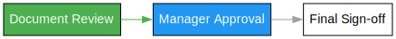

# Simple Workflow Package (SWF)

This package provides a simple, linear workflow management system in Go. It is designed for human-driven processes where steps require manual intervention, approval, or completion by users.



## Overview

The workflow package allows you to create and manage linear, sequential workflows that are typically driven by human interaction. It provides functionality to:

- Create and manage steps in a sequential workflow
- Track the current step and who is responsible for it
- Determine if steps are complete
- Calculate workflow progress
- Store and retrieve metadata for steps
- Serialize and deserialize workflow state
- Visualize the workflow as a DOT graph

> **Note**: This is a simple linear workflow system designed for human-driven processes. It does not support complex workflows with branching paths or DAGs (Directed Acyclic Graphs). Each step follows the previous one in a straightforward sequence and typically requires manual completion.

## When to Use This Package

This package is ideal for:

- Document approval workflows
- Employee onboarding processes
- Manual review workflows
- Form completion wizards
- Business process checklists
- Project stage gates
- Any process where human intervention is required at each step

It is not suitable for:

- Automated processing workflows
- Complex workflows with branching paths
- DAG-based workflows
- Parallel processing workflows
- Workflows requiring conditional branching
- Automated task execution

## Components

### Step

A `Step` represents a single step in a workflow. Each step has:

- `Name`: Unique identifier for the step
- `Type`: Type of the step (default: "normal")
- `Title`: Display title for the step
- `Description`: Description of what the step does
- `Responsible`: Person or role responsible for completing the step

### Workflow

A `Workflow` manages multiple steps and tracks the workflow state. It provides methods to:

- Add steps to the workflow
- Get and set the current step
- Check if a step is current or complete
- Calculate workflow progress
- Store and retrieve metadata for steps
- Serialize and deserialize workflow state
- Visualize the workflow as a DOT graph

## Usage

```go
package main

import (
    "fmt"
    "github.com/yourusername/workflow"
)

func main() {
    // Create a new linear workflow
    wf := workflow.NewWorkflow()

    // Create steps in sequence
    step1 := workflow.NewStep("step1")
    step1.Title = "Document Review"
    step1.Description = "Review the submitted document"
    step1.Responsible = "John Doe" // Person responsible for completing this step

    step2 := workflow.NewStep("step2")
    step2.Title = "Manager Approval"
    step2.Description = "Manager approval of the document"
    step2.Responsible = "Jane Smith" // Person responsible for completing this step

    // Add steps to the workflow in sequence
    wf.AddStep(step1)
    wf.AddStep(step2)

    // Steps will be executed in the order they were added
    // Each step requires manual completion by the responsible person
    // Get the current step
    currentStep := wf.GetCurrentStep()
    fmt.Printf("Current step: %s\n", currentStep.Name)

    // Move to the next step
    wf.SetCurrentStep(step2)

    // Check if a step is complete
    isComplete := wf.IsStepComplete(step1)
    fmt.Printf("Is step1 complete? %v\n", isComplete)

    // Get progress
    progress := wf.GetProgress()
    fmt.Printf("Progress: %d/%d steps completed (%.2f%%)\n",
        progress.Completed, progress.Total, progress.Percents)

    // Visualize the workflow
    dotGraph := wf.Visualize()
    fmt.Println("Workflow visualization (DOT format):")
    fmt.Println(dotGraph)
}
```

## Visualization

The package provides a visualization feature that generates a DOT graph
representation of the workflow. The visualization:

- Shows steps as boxes with their titles
- Uses colors to indicate status:
  - White: Pending steps
  - Blue (#2196F3): Current step
  - Green (#4CAF50): Completed steps
- Shows edges between steps with:
  - Gray (#9E9E9E): Default edge color
  - Green (#4CAF50): Completed path
- Includes tooltips with step descriptions
- Arranges the graph left-to-right

You can render the DOT graph using:

1. Graphviz's `dot` command: `dot -Tpng workflow.dot -o workflow.png`
2. Online tools like [Graphviz Online](https://dreampuf.github.io/GraphvizOnline/)
3. The [Graphviz Visual Editor](http://magjac.com/graphviz-visual-editor/)
